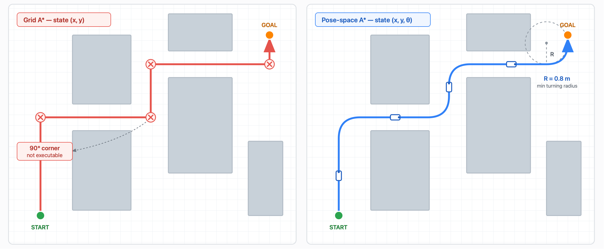
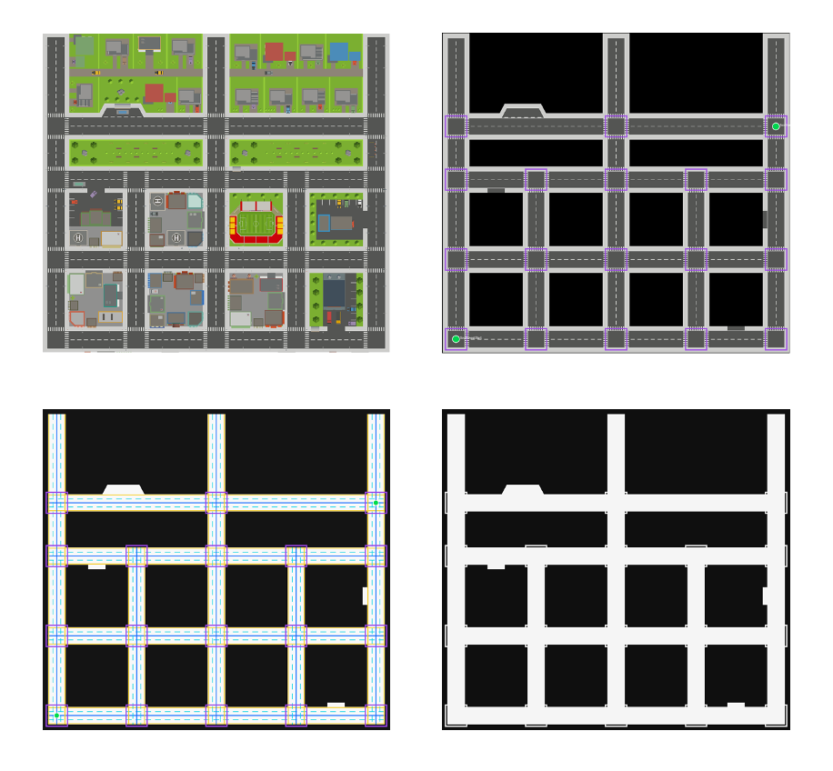
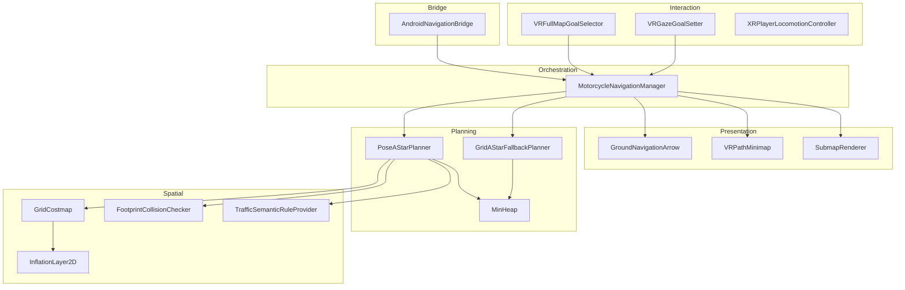
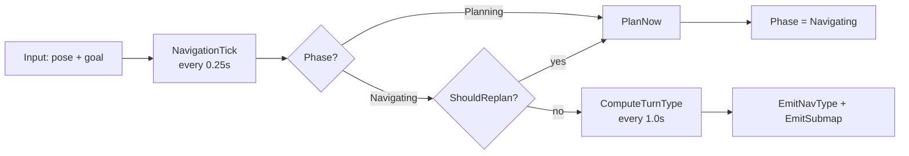

# AR Intelligent Helmet

**Motorcycle navigation for an AR helmet — a hand-written pose-space path planner running in Unity, streaming turn-by-turn guidance to an Android/RK3588 head-mounted display.**

Riders who glance at a phone take their eyes off the road and a hand off the bar. This project puts navigation into the rider's field of view instead. The routes it produces respect the motorcycle's actual turning radius, so they are rideable — not the right-angle paths a grid algorithm hands you.

<!-- ═══════════════════════════════════════════════════════════
     IMAGE SLOT 1 — HERO GIF (highest priority, put real effort here)
     File: docs/images/hero-demo.gif
     ═══════════════════════════════════════════════════════════ -->


---

## Contents

- [What it does](#what-it-does)
- [Why a custom planner](#why-a-custom-planner)
- [How the planner works](#how-the-planner-works)
- [Spatial representation](#spatial-representation)
- [Semantic traffic rules](#semantic-traffic-rules)
- [Hardware bridge](#hardware-bridge)
- [Architecture](#architecture)
- [Repository layout](#repository-layout)
- [Getting started](#getting-started)
- [Measured performance](#measured-performance)
- [Design decisions and trade-offs](#design-decisions-and-trade-offs)
- [Known limitations](#known-limitations)
- [Roadmap](#roadmap)

---

## What it does

| | |
|---|---|
| **Plans** | Kinematically feasible routes across a 258 × 238 m city using a pose-space A\* that carries heading in the search state |
| **Represents** | A 1024 × 1024 occupancy grid (~1.05M cells) with a ROS `costmap_2d`-style cost convention and an inflation layer |
| **Obeys** | Lane direction, solid/dashed boundary rules, turn connectors, and no-U-turn regions via a pluggable semantic rule layer |
| **Streams** | 6 discrete turn cues plus a JPEG-compressed 256 px local submap to an Android-hosted helmet display at 1 Hz |
| **Runs on** | Unity 6000.4.1f1 (URP, IL2CPP, ARM64) targeting Android 12 / RK3588, with OpenXR + XR Interaction Toolkit |

<!-- ═══════════════════════════════════════════════════════════
     IMAGE SLOT 2 — HARDWARE PHOTO
     File: docs/images/helmet-hardware.jpg
     ═══════════════════════════════════════════════════════════ -->


---

## Why a custom planner

Unity's built-in NavMesh is designed for humanoid agents that can pivot in place and accelerate in any direction. A motorcycle can do neither — it has a minimum turning radius and no lateral motion. A NavMesh path is physically un-rideable.

The alternatives all had costs that did not fit an embedded capstone:

| Option | Why not |
|---|---|
| NavMesh + path smoothing | Treats the symptom. Corners can still exceed the vehicle's turning capability. |
| ROS + `move_base` | Cross-process complexity on an ARM board, plus a second runtime to deploy. |
| Commercial navigation SDK | Cost, closed source, and no way to express custom lane semantics. |

So the planner is written from scratch, with the vehicle's kinematics baked into the search itself.

---

## How the planner works

### Heading is part of the state

Plain grid A\* searches over `(x, y)`. That representation cannot express a turning constraint, because the constraint is on *how fast heading changes*. So the search state is `(x, y, θ)` with θ discretized into 32 heading bins:

```
state space = 1024 × 1024 cells × 32 heading bins ≈ 33.5 million states
```

The three-dimensional state is packed into a single `int` so node records can live in a sparse dictionary:

```csharp
Key(x, y, heading) = heading * (Width * Height) + Index(x, y)
```

Only visited states allocate — a typical query touches a few hundred thousand of the 33.5 million.

### The turning constraint is derived, not tuned

A vehicle travelling arc length *s* at radius *R* rotates by **θ = s / R** radians. That single relationship converts a physical parameter into a search constraint:

```csharp
maxYawChangeRad = stepMeters / minTurningRadiusMeters;   // 0.5 / 0.8 = 0.625 rad
maxTurnBins     = floor(maxYawChangeRad / headingStepRad); // 0.625 / 0.196 ≈ 3
```

With 32 bins at 11.25° each, the planner may cross at most 3 bins per expansion — **at most 7 neighbors instead of 32**. Displacement uses the *midpoint* heading between the current and next bin, a first-order approximation of the arc.

<!-- ═══════════════════════════════════════════════════════════
     IMAGE SLOT 3 — PLANNER COMPARISON (highest technical value)
     File: docs/images/planner-comparison.png
     ═══════════════════════════════════════════════════════════ -->



*Left: position-only grid A\* produces axis-aligned corners a motorcycle cannot execute. Right: pose-space A\* respects the 0.8 m minimum turning radius.*

### Cost function

```csharp
g += distance * laneMultiplier   // detour
   + turnCost                    // |Δheading| × turnPenalty
   + inflatedCost                // proximity to obstacles
   + lanePenalty;                // traffic-rule violation
```

Four terms penalizing, respectively: going long, turning often, hugging walls, and breaking traffic rules.

### Open set

A hand-written binary min-heap backs the open set. There is no `decrease-key`; when a shorter path to a state is found, a new entry is pushed and stale entries are discarded at pop time by checking the closed flag:

```csharp
OpenItem item = open.Pop();
if (!records.TryGetValue(item.key, out current) || current.closed)
    continue;   // stale entry, skip
```

This trades a slightly larger heap for avoiding an element-to-heap-index structure. Both planners share the same generic heap.

---

## Spatial representation

The costmap is built from a top-down image — either a prebaked texture or a live render-texture capture of an overhead camera. Scene geometry is deliberately *not* raycast: the environment has no reliable colliders, and a million raycasts would not be viable anyway.

Cost values follow the ROS `costmap_2d` convention:

| Value | Meaning |
|---|---|
| `0` | Free space |
| `1–252` | Inflation gradient |
| `253` | Inscribed inflated obstacle |
| `254` | Lethal obstacle |
| `255` | No information |

### Pixel classification

```
alpha ≤ 0.05                                   → NoInformation
luma  = 0.2126R + 0.7152G + 0.0722B            (ITU-R BT.709)
luma ≤ threshold                               → obstacle candidate
  ... unless HSV saturation ≥ 0.45 and value ≥ 0.25   → annotation color, not an obstacle
```

That last rule matters more than it looks. Yellow lane markings and red no-entry overlays drawn on a map image are dark enough to classify as obstacles, which would **sever the road** and make every route fail. The saturation test separates colored annotation from genuinely dark geometry.

### Inflation layer

Every lethal cell is seeded into the min-heap as a **multi-source** frontier and popped in increasing distance order — a Dijkstra wavefront, equivalent to a bounded Euclidean distance transform. Each cell inherits its originating source and recomputes true Euclidean distance to it, rather than accumulating path length.

```csharp
if (distanceMeters <= inscribedRadiusMeters) return InscribedInflatedObstacle;
factor = exp(-costScalingFactor * (distanceMeters - inscribedRadiusMeters));
```

Without this, hugging a wall and driving down the middle cost exactly the same and the planner picks arbitrarily.

<!-- ═══════════════════════════════════════════════════════════
     IMAGE SLOT 4 — COSTMAP VISUALIZATION
     File: docs/images/costmap-inflation.png
     ═══════════════════════════════════════════════════════════ -->




### Collision checking

Two layers. `IsPoseFree` tests the vehicle's rectangular footprint at a single pose — bounding-circle prune, then transform candidate cells into the vehicle's local frame and test against half-width and half-length. `IsSegmentFree` is the swept version, interpolating position linearly and heading with `LerpAngle` at 3 samples per meter.

This is sampled approximation, not analytic continuous collision detection — adequate at this cell resolution, but not mathematically exhaustive.

---

## Semantic traffic rules

Traffic law is domain knowledge, not algorithm. Embedding it in the search would bind the planner to roads permanently, so it lives behind an abstract base class with five methods:

```csharp
bool  AllowsPose(GridCostmap map, int x, int y, float yawDeg);
bool  AllowsTransition(GridCostmap map, NavPose from, NavPose to);
bool  AllowsTurn(Vector3 world, float fromYaw, float toYaw);
float TraversalMultiplier(GridCostmap map, int x, int y, float yawDeg);
float TransitionMultiplier(GridCostmap map, NavPose from, NavPose to);
```

Three implementations ship: a null provider, a simple directional-lane provider, and a full semantic map loaded from JSON. Passing `null` disables all rules — genuinely useful for isolating whether a planning failure is an algorithm problem or an over-strict rule.

The semantic map models:

- **Lanes** — rectangle or polygon, with a nominal heading, angular tolerance, wrong-way cost multiplier, and left/right boundary types (`None` / `Dashed` / `Solid`)
- **Turn connectors** — explicit `fromLane → toLane` permissions for straight, left, right, and U-turn maneuvers
- **Rule regions** — no-U-turn zones, lane-change-blocked zones, and area cost multipliers

Lane-change legality is decided by which boundary the transition crosses: solid lines block outright, dashed lines apply a small penalty, and unknown boundaries apply a configurable middle penalty.

<!-- ═══════════════════════════════════════════════════════════
     IMAGE SLOT 5 — SEMANTIC MAP OVERLAY
     File: docs/images/semantic-lanes.png
     ═══════════════════════════════════════════════════════════ -->

<!---->

---

## Hardware bridge

The planner runs inside Unity; the helmet display is driven by an Android host on an RK3588 board. The two communicate over Unity's `SendMessage`, which carries exactly one string per call — so everything is serialized by hand.

**Inbound** — rider pose arrives as comma-separated floats and is parsed tolerantly (malformed input is ignored rather than throwing, and `InvariantCulture` avoids locales where the decimal separator is a comma). When orientation is unavailable, heading is inferred from consecutive displacement, gated at 2 cm to keep a stationary rider's heading from jittering on noise.

**Outbound** — two payloads, at 1 Hz:

1. **A turn cue** — one of six `NavTurnType` values (`Straight`, `Left`, `LeftForward`, `RightForward`, `Right`, `UTurn`), computed by projecting the rider onto the path *segment* (not the nearest waypoint, which would jump discontinuously) and scanning forward 12 m for the first vertex whose signed direction change exceeds 15°.
2. **A local submap** — an 18 m window around the rider, rendered at 256 px with the upcoming route drawn in, JPEG-encoded at quality 70 and sent as a base64 data URI.

Every number there is a bandwidth and power decision. During planning a procedurally generated spinner is pushed instead, so the display never freezes.

<!-- ═══════════════════════════════════════════════════════════
     IMAGE SLOT 6 — SUBMAP OUTPUT
     File: docs/images/submap-output.png
     ═══════════════════════════════════════════════════════════ -->

<!---->

---

## Architecture



The planning and spatial layers are plain C# with **no `MonoBehaviour` dependency**, which keeps them unit-testable in isolation and portable outside Unity.

### Runtime loop



Two-stage throttling is deliberate: 0.25 s for logic decisions, which need to be reasonably prompt, and 1.0 s for hardware pushes, which cost bandwidth and power.

### Replanning

Four triggers, tiered so the system does not thrash at a threshold:

| Trigger | Condition |
|---|---|
| Severe drift | > 2.5 m from path — fires immediately, bypassing cooldown |
| Normal drift | > 1.2 m from path — requires 0.75 s cooldown |
| Path blocked | Any of the next 12 waypoints in collision |
| Stuck | Remaining distance has not decreased by > 0.25 m for 3 s |

Progress is measured by *remaining distance shrinking*, not by position changing — a rider circling in place moves without progressing.

---

## Repository layout

```
Assets/Assets/Scripts/
├── MotorcycleNavigationManager.cs    Orchestrator: build, pose, replan, output
├── MotorcycleNavigationTypes.cs      All data types and settings classes
│
├── PoseAStarPlanner.cs               Pose-space (x, y, θ) A*
├── GridAStarFallbackPlanner.cs       Position-only 4-connected A*
├── MinHeap.cs                        Generic binary min-heap
│
├── GridCostmap.cs                    Occupancy grid, texture → costmap
├── InflationLayer2D.cs               Multi-source Dijkstra distance transform
├── FootprintCollisionChecker.cs      Pose and swept-segment collision
│
├── NavigationRuleProviderBase.cs     Rule interface + null implementation
├── TrafficSemanticRuleProvider.cs    Lanes, connectors, regions, JSON loading
│
├── AndroidNavigationBridge.cs        Android ↔ Unity message bridge
├── SubmapRenderer.cs                 Local map rendering + JPEG encoding
│
├── VRFullMapGoalSelector.cs          Full-map UI and pointer goal selection
├── VRGazeGoalSetter.cs               Gaze-based goal selection
├── VRPathMinimap.cs                  Wrist-mounted minimap
├── GroundNavigationArrow.cs          Ground-projected direction arrow
├── XRPlayerLocomotionController.cs   WASD / flight / view control
│
├── PlannedPathAutoMover.cs           Follows the planned route automatically
├── VehicleTrajectoryRecorder.cs      Records a path for a follower vehicle
├── ScriptedTrajectoryFollower.cs     Simulated follower vehicle
└── VehicleProximityAlarm.cs          Proximity warning with hysteresis
```

---

## Getting started

### Requirements

- Unity **6000.4.1f1** with URP
- For device builds: Android SDK, IL2CPP, ARM64

### Running the simulation

1. Open the project in Unity Hub
2. Open `Assets/Assets/SimplePoly City - Low Poly Assets/Demo/SimplePoly City - Low Poly Assets_Demo Scene.unity` (Build Index 0)
3. Enter Play Mode — the costmap builds automatically from the top-down camera
4. Press `M` to toggle the full map, or double-tap when hidden
5. Click a road to set a destination; the route is planned and drawn
6. The ground arrow and minimap update as you move

<!-- ═══════════════════════════════════════════════════════════
     IMAGE SLOT 7 — FULL MAP UI
     File: docs/images/goal-selection.png
     ═══════════════════════════════════════════════════════════ -->


### Android / RK3588 build notes

Two settings are required for this hardware and are easy to lose:

| Setting | Value | Reason |
|---|---|---|
| Android Graphics API | **OpenGLES3 only** | The RK3588 Vulkan driver produced a black screen |
| OpenXR `m_vulkanOffscreenSwapchainNoMainDisplay` | `0` | Disables offscreen-rendering-only, same black-screen cause |

Input is read through `Pointer.current`, the common base class of `Mouse`, `Touchscreen`, and `Pen` — RK3588's customized Android reports its pointer devices as `Touchscreen`, so a `Mouse`-only implementation receives nothing.

### Configuration

All tuning lives in serialized settings classes on `MotorcycleNavigationManager`:

| Class | Controls |
|---|---|
| `CostmapBuildSettings` | Resolution, world origin, obstacle thresholds, annotation-color filtering |
| `InflationSettings` | Inflation radius, inscribed radius, cost scaling |
| `MotorcycleFootprintSettings` | Vehicle dimensions, collision sampling density |
| `PlannerSettings` | Heading bins, step size, turning radius, cost weights, node cap, planner selection |
| `NavigationRuntimeSettings` | Tick rates, replan thresholds, submap size, JPEG quality |

---

## Measured performance

One representative query, logged from the Unity editor:

```
points=19  length=301.4m  turns=17  expanded=156075
```

A 301-meter route across the city, expanding roughly 156,000 nodes — about **0.5% of the 33.5-million-state space**. The heuristic prunes the rest.

<!-- ═══════════════════════════════════════════════════════════
     IMAGE SLOT 8 — SEARCH EXPANSION VISUALIZATION (optional, high impact)
     File: docs/images/search-expansion.png
     ═══════════════════════════════════════════════════════════ -->

<!---->

A benchmark harness (`NavigationBenchmark.cs`) runs seeded randomized start/goal pairs across both planners and reports success rate, planning latency percentiles, expansion counts, and cumulative heading change. Attach it to any GameObject in the scene, assign the manager, and run **Run Benchmark** from the component context menu.

---

## Design decisions and trade-offs

### The shipped demo uses the grid planner

`PlannerSettings.useGridPlannerOnly` is enabled in the demo scene, so the position-only planner is what actually runs.

On a sparse semantic road mask the pose planner's success rate was not high enough for an interactive demo. It requires the full vehicle footprint to be collision-free at both endpoints, every segment to pass swept collision checking, and lane heading constraints on top — on narrow roads it fails outright. The grid planner tests single-cell traversability only.

The trade: an interactive demo needs a route on *every* click, so robustness outranked kinematic optimality. Both planners are retained, and `fallbackToGridPlanner` supports pose-first-with-degradation as an alternative configuration.

### Costmap from imagery rather than geometry

Makes the map a swappable data asset — the Android host can push a new map image at runtime to rebuild the costmap. The cost is that the map is static.

### `SendMessage` rather than JNI

Lowest-friction official channel for Unity ↔ Android native, and one line on the Android side. The costs are real and accepted: reflection dispatch is slow, `GameObject.Find` walks the scene tree per call, method names are unchecked strings, and with `DontRequireReceiver` a typo fails silently.

---

## Known limitations

Stated plainly, because they shape what this code is and is not:

- **Planning is synchronous on the Unity main thread.** A global query far exceeds a VR frame budget. Mitigated by throttling and a loading indicator, not solved.
- **The costmap is static.** Dynamic vehicles are not written into it, so the planner will not route around moving traffic.
- **No automated tests.** The planning and spatial layers are pure C# and would be straightforward to cover in EditMode tests; this has not been done.
- **Collision checking is sampled, not analytic.** Obstacles thinner than the sample spacing can theoretically be missed.
- **The heuristic is not strictly admissible.** The lane-aligned cost multiplier is below 1, so Euclidean distance is not a true lower bound and optimality is not guaranteed.
- **On-device verification of the pointer input fix is incomplete.** It is verified in the editor.

---

## Roadmap

- [ ] Move planning off the main thread — time-sliced incremental search first, since it needs no concurrency and the change is contained in the planner loop
- [ ] EditMode test coverage: heap invariants, world↔cell round trips, and a property test asserting every path segment satisfies the turning-radius constraint
- [ ] Dynamic obstacle costmap layer for moving traffic
- [ ] Success-rate and path-quality benchmark comparing both planners on identical queries
- [ ] Structured logging with levels and on-device persistence
- [ ] Preserve the last valid route when a replan fails, instead of clearing the display

---

## License

<!-- Pick one. MIT is the usual default for a portfolio project. -->
TBD

---

<!-- ═══════════════════════════════════════════════════════════
     IMAGE SLOT 9 — FIRST-PERSON GROUND ARROW (optional closer)
     File: docs/images/ground-arrow-fpv.gif
     ═══════════════════════════════════════════════════════════ 

-->
