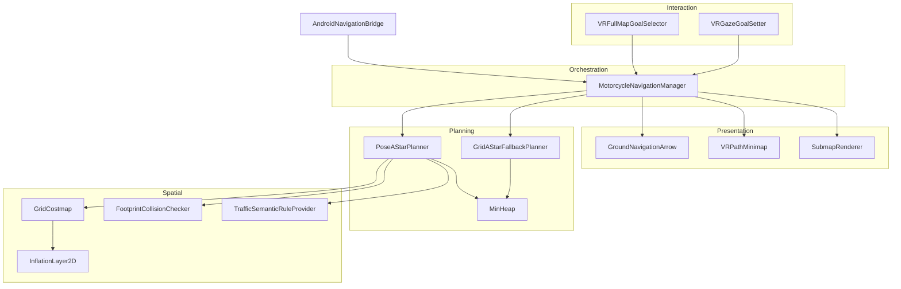

# AR Intelligent Helmet

**Motorcycle navigation for an AR helmet — a hand-written pose-space path planner in Unity, streaming turn-by-turn guidance to an Android/RK3588 head-mounted display.**

Checking a phone while riding means looking down and losing a hand. This puts navigation in the rider's field of view instead — and because the planner carries heading in its search state, the routes it produces are actually rideable, not the right-angle paths a grid algorithm returns.

*Built for a capstone by a five-person team. This repository is the navigation and path-planning subsystem; localization, VR/HMI, and hardware integration were owned by teammates.*


| | |
|---|---|
| **Plans** | Pose-space A\* over a 33.5M-state space, constrained by a 0.8 m minimum turning radius |
| **Represents** | 1024 × 1024 occupancy grid (~1.05M cells), ROS `costmap_2d` conventions, inflation layer |
| **Obeys** | Lane direction, solid/dashed boundaries, turn connectors — a pluggable semantic rule layer |
| **Streams** | 6 turn cues + a JPEG-compressed 256 px local submap to a Micro OLED display at 1 Hz |
| **Verified** | 6 QFD-derived specifications — 30 ms route update, 30 FPS, 90 ms latency, 10 min zero-failure run |
| **Runs on** | Unity 6000.4.1f1 · URP · IL2CPP/ARM64 · Android 12 / RK3588 · OpenXR |


---

## Why not NavMesh

Unity's NavMesh assumes a humanoid agent that can pivot in place and accelerate in any direction. A motorcycle can do neither — it has a minimum turning radius and no lateral motion, so a NavMesh path is physically un-rideable. Smoothing the output only treats the symptom; corners can still exceed what the vehicle can execute.

So the planner is written from scratch, with the vehicle's kinematics built into the search itself.

---

## How the planner works

**Heading is part of the state.** Plain grid A\* searches `(x, y)`, which cannot express a turning constraint — the constraint is on how fast heading *changes*. The search state here is `(x, y, θ)` with θ in 32 bins, giving ~33.5 million states. Each state packs into one `int` (`heading * cellCount + cellIndex`) so records live in a sparse dictionary; only visited states allocate.

**The turn limit is derived, not tuned.** A vehicle travelling arc length *s* at radius *R* rotates by θ = s/R radians:

```csharp
maxYawChangeRad = stepMeters / minTurningRadiusMeters;    // 0.5 / 0.8 = 0.625 rad
maxTurnBins     = floor(maxYawChangeRad / headingStepRad); // ≈ 3 of 32 bins
```

That caps expansion at **7 neighbors instead of 32**, and every transition is feasible by construction. Displacement uses the midpoint heading between bins — a first-order approximation of the arc.


**Cost function.** Four terms penalize detours, frequent turning, obstacle proximity, and traffic-rule violations:

```csharp
g += distance * laneMultiplier + turnCost + inflatedCost + lanePenalty;
```

**Open set.** A hand-written binary min-heap, shared by both planners. There is no `decrease-key` — a better path pushes a new entry, and stale entries are discarded at pop time by checking the closed flag. That trades a larger heap for not maintaining an element-to-heap-index structure.

---

## Costmap and inflation

The grid is built from a top-down image — a prebaked texture or a live render-texture capture. Scene geometry is deliberately *not* raycast: the environment has no reliable colliders, and a million raycasts would not be viable anyway. Cost values follow ROS `costmap_2d` (`253` inscribed, `254` lethal, `255` unknown).

Pixel classification runs luma thresholding with one important exception: pixels with HSV saturation ≥ 0.45 are treated as **annotation color, not obstacle**. Yellow lane markings and red no-entry overlays are dark enough to classify as walls, which would sever the road and fail every route.

Inflation seeds every lethal cell into the min-heap as a multi-source frontier and pops in increasing distance order — a Dijkstra wavefront, equivalent to a bounded Euclidean distance transform. Each cell inherits its originating source and recomputes true Euclidean distance to it, then maps distance to cost with exponential decay. Without it, hugging a wall and driving down the middle cost exactly the same.


Collision checking has two layers: a footprint test at a single pose (bounding-circle prune, then a rectangle test in the vehicle's local frame), and a swept version interpolating position and heading at 3 samples per meter.

---

## Semantic traffic rules

Traffic law is domain knowledge, not algorithm — embedding it in the search would bind the planner to roads permanently. It lives behind an abstract base class with five methods:

```csharp
bool  AllowsPose(...);            float TraversalMultiplier(...);
bool  AllowsTransition(...);      float TransitionMultiplier(...);
bool  AllowsTurn(...);
```

Three implementations ship: a null provider, a directional-lane provider, and a JSON-driven semantic map with lanes (heading, tolerance, wrong-way multiplier, `Solid`/`Dashed` boundaries), explicit turn connectors, and no-U-turn regions. Lane-change legality is decided by which boundary the transition crosses — solid blocks outright, dashed applies a small penalty.

Passing `null` disables all rules, which is how you tell whether a planning failure is an algorithm problem or an over-strict rule.

---

## Architecture



The planning and spatial layers are plain C# with **no `MonoBehaviour` dependency** — unit-testable in isolation and portable outside Unity.

The manager ticks at 0.25 s for logic and pushes to hardware at 1 Hz. Replanning uses tiered thresholds so it does not thrash at a boundary: severe drift (> 2.5 m) fires immediately, normal drift (> 1.2 m) waits out a 0.75 s cooldown, and a stuck check watches whether *remaining distance* is shrinking rather than whether position is changing — a rider circling in place moves without progressing.

---

## Hardware bridge

Unity and the Android host communicate over `SendMessage`, which carries one string per call, so everything is serialized by hand. Rider pose originates from a u-blox M8N GPS and MPU-9250 IMU fused through an Extended Kalman Filter with map matching, and arrives here as comma-separated floats. Parsing is tolerant — malformed input is ignored rather than thrown, and when orientation is unavailable, heading is inferred from displacement, gated at 2 cm so a stationary rider's heading does not jitter on noise.

Two payloads go out at 1 Hz: one of six `NavTurnType` cues, computed by projecting the rider onto the path *segment* (not the nearest waypoint, which jumps discontinuously) and scanning 12 m ahead for the first direction change over 15°; and an 18 m local submap rendered at 256 px, JPEG-encoded at quality 70 as a base64 data URI. Every number there is a bandwidth and power decision. During planning a procedurally generated spinner goes out instead, so the display never freezes.


---

## Running it

Requires **Unity 6000.4.1f1** with URP. Open `Assets/Assets/SimplePoly City - Low Poly Assets/Demo/SimplePoly City - Low Poly Assets_Demo Scene.unity` (Build Index 0) and enter Play Mode — the costmap builds automatically from the top-down camera. Press `M` to toggle the map, click a road to set a destination.

Two settings are required for RK3588 and easy to lose:

| Setting | Value | Reason |
|---|---|---|
| Android Graphics API | **OpenGLES3 only** | The RK3588 Vulkan driver produced a black screen |
| OpenXR `m_vulkanOffscreenSwapchainNoMainDisplay` | `0` | Same black-screen cause |

Input reads `Pointer.current`, the common base class of `Mouse`, `Touchscreen`, and `Pen` — RK3588's customized Android reports its pointer devices as `Touchscreen`, so a `Mouse`-only implementation receives nothing.

All tuning lives in serialized settings classes on `MotorcycleNavigationManager`: costmap build, inflation, footprint, planner, and runtime.

---

## Validation

Six engineering specifications were derived from customer requirements through a QFD analysis, each bound to a measurable verification method up front, then measured in the Unity environment.

| Specification | Target | Measured |
|---|---|---|
| Route update | ≤ 50 ms | **~30 ms** (on a ~200 m local cost map) |
| Off-route replanning | ≤ 1 s | ~1 s |
| Map generation | ≤ 2 s | ~1 s |
| Peak memory | ≤ 200 MB | ~20 MB |
| Pose update rate | ≥ 10 Hz | 10 Hz |
| Frame rate | ≥ 30 FPS | 30 FPS (mean and minimum) |
| Pose-to-render latency | < 100 ms | ~90 ms mean |
| Continuous operation | ≥ 10 min | 10 min, zero crashes / planning failures / warning-state errors |

Hazard warning was tested across four scenarios — vehicle approaching from behind (3 m), leading vehicle decelerating (3 m), pedestrian crossing (8 m), emergency vehicle (10 m) — plus a no-hazard control. All four produced the correct warning; the control produced none.

**What this does not establish.** The Unity ground-truth pose does not reproduce GPS/IMU noise, bias, or drift, so the ≤ 1.0 m physical localization target is unverified. Software frame rate and latency exclude the Micro OLED module's communication and optical delay. Simulated lighting demonstrates nothing about outdoor brightness, contrast, or rider visibility. Four scripted hazard scenarios do not represent real-world recognition under weather, occlusion, and traffic. Planning timings apply to the tested map size and configuration. Ten minutes says nothing about thermal behaviour, battery endurance, or long-term durability.

---

## The shipped demo uses the grid planner

`PlannerSettings.useGridPlannerOnly` is enabled in the demo scene, so the position-only planner is what actually runs.

On a sparse semantic road mask the pose planner's success rate was not high enough for an interactive demo — it requires the full footprint clear at both endpoints, every segment to pass swept collision checking, and lane heading constraints on top. The grid planner tests single-cell traversability only. The trade: an interactive demo needs a route on *every* click, so robustness outranked kinematic optimality. Both planners are retained, and `fallbackToGridPlanner` supports pose-first-with-degradation as an alternative.

One representative query, logged from the editor:

```
points=19  length=301.4m  turns=17  expanded=156075
```

A 301-meter route expanding ~156,000 nodes — about **0.5% of the state space**. `NavigationBenchmark.cs` runs seeded randomized start/goal pairs across both planners and reports success rate, latency percentiles, and cumulative heading change.

---

## Known gaps

- **Planning is synchronous on the Unity main thread.** A global query far exceeds a VR frame budget. Mitigated by throttling and a loading indicator, not solved.
- **The costmap is static.** Dynamic vehicles are not written into it, so the planner will not route around moving traffic.
- **No automated tests.** Validation above was executed manually against the specification table. The planning and spatial layers are pure C# with no `MonoBehaviour` dependency and would be straightforward to cover in EditMode tests — the first one worth writing asserts that every segment of a returned path satisfies the minimum turning radius.
- **Collision checking is sampled, not analytic.** Obstacles thinner than the sample spacing can theoretically be missed.
- **The heuristic is not strictly admissible.** The lane-aligned cost multiplier is below 1, so Euclidean distance is not a true lower bound and optimality is not guaranteed.

